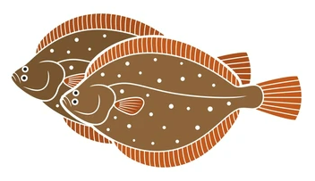

<!-- README.md is generated from README.Rmd. Please edit that file -->

```{r, include = FALSE}
knitr::opts_chunk$set(
  collapse = TRUE,
  comment = "#>",
  fig.path = "man/figures/README-",
  out.width = "100%"
)
```

# gulf2 

<!-- badges: start -->
<!-- badges: end -->


## What is gulf2?

The *gulf2* package is an umbrella for the collection of packages for accessing, manipulating, displaying and analyzing southern Gulf data sets.

## gulf2 is split into a family of packages

The original `gulf` package has now been divided into a family of sub-packages that handle specific aspects of data documentation, access, display and analysis:

| Sub-package | GitHub repository | Description |
| ----------  | ----------------- | ----------  |
| `gulf2` | [GitHub R package version](https://github.com/RicardD/gulf2) | Umbrella package |
| `gulf.utils` | [GitHub R package version](https://github.com/TobieSurette/gulf.utils) | Basic utilities |
| `gulf.data` | [GitHub R package version](https://github.com/TobieSurette/gulf.data) | Data |
| `gulf.graphics` | [GitHub R package version](https://github.com/TobieSurette/gulf.graphics) | Graphics |
| `gulf.manage` | [GitHub R package version](https://github.com/TobieSurette/gulf.manage) | Management utilities |
| `gulf.metadata` | [GitHub R package version](https://github.com/TobieSurette/gulf.metadata) | Metadata utilities |
| `gulf.spatial` | [GitHub R package version](https://github.com/TobieSurette/gulf.spatial) | Spatial utilities |
| `gulf.stats` | [GitHub R package version](https://github.com/TobieSurette/gulf.stats) | Statistical utilities |

## Installation
When you install the umbrella package *gulf2*, all the sub-packages listed above will be installed. When you load the new umbrella *gulf2* package in an R session, all the sub-packages listed above will be loaded or imported.

You can install gulf2 from [GitHub](https://github.com/) with:

``` r
# install.packages("devtools")
devtools::install_github("ricardd/gulf2")
```
